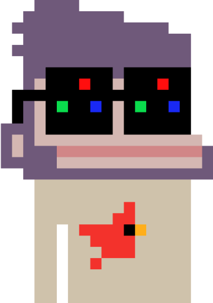

<p align="center"><h1 align="center">nounbricks <p align="center">a component library for noun assets</p></h1></p>

> You can read a more user friendly version of this documentation at [nounbricks.netlify.app](https://nounbricks.netlify.app)

## Getting Started

Nounbricks is a component library built to make it easy for you to add noun assets to your Javascript projects.

> ⚠️ Nounbricks is currently under development and is not yet ready for production use.

### Installing NounBricks

#### With build tools

Install the nounbricks npm package

```sh
npm install @nounbricks/nounbricks-vue
```

Import and use the components from `@nounbricks/nounbricks-vue` 🎉

```vue
<template>
  <FullNoun
    body="bege-crt"
    head="head-ape"
    accessories="bird-side"
    glasses="glasses-square-black-rgb"
  ></FullNoun>
</template>

<script setup>
import { FullNoun } from "@nounbricks/nounbricks-vue";
</script>
```

#### Without build tools

You can try out nounbricks components directly on the browser.

```html
<div id="app"></div>

<!-- load vue before loading nounbricks -->
<script src="https://unpkg.com/vue@3"></script>
<!-- import nounbricks from unpkg -->
<script src="https://unpkg.com/@nounbricks/nounbricks-vue"></script>
<script>
  const { FullNoun } = nounbricks;
  const { createApp } = Vue;
  const app = createApp({
    components: {
      FullNoun,
    },
    template: `<FullNoun
        body="bege-crt"
        head="head-bag"
        accessories="bird-side"
        glasses="glasses-square-black-rgb"

        bg-color="d5d7e1"
      ></FullNoun>`,
  });

  app.mount("#app");
</script>
```

## Component Options

> You can find more examples for the component options in respective component sections.

### Render a noun with background

All the components ( `FullNoun`, `NounHead`, `NounGlasses`, `NounBody`, `NounAccessory` have a prop `bg-color` ) which lets you specify any background color ( as hex code ) for your rendered noun/noun trait.

```vue
<fullnoun ... bg-color="d5d7e1" />
```

### Render a noun without a background

you can omit the `bg-color` prop to render a noun/noun trait without any backgroud.

### Fit to bounds

normally nouns are rendered within a 320x320 square. mostly this leaves additional space which we might want to get rid of. in that situation you can use a `fit-to-bounds` prop and it should remove all the additional space.

```vue
<fullnoun ... fit-to-bounds />
```

### Render as an IMG or SVG

you might want to render the noun as an img instead of a full svg. this helps performance when rendering a lot of nouns together. in those scenarios you can use the `renderType` prop.

the default value for renderType is `svg`

```vue-html
<fullnoun
    ...
    renderType="img"
/>
```

## Components

### FullNoun

Use this component to render a full noun

#### FullNoun with background

```html
<FullNoun
  body="body-bege-crt"
  head="head-ape"
  accessory="accessory-bird-side"
  glasses="glasses-square-black-rgb"
  bg-color="d5d7e1"
></FullNoun>
```

#### FullNoun without background

```html
<FullNoun
  body="body-bege-crt"
  head="head-ape"
  accessory="accessory-bird-side"
  glasses="glasses-square-black-rgb"
></FullNoun>
```

#### FullNoun Fit Bounds

```html
<FullNoun
  body="body-bege-crt"
  head="head-ape"
  accessory="accessory-bird-side"
  glasses="glasses-square-black-rgb"
  fit-to-bounds
></FullNoun>
```

#### FullNoun, Render as an IMG instead of SVG

```html
<FullNoun
  body="body-bege-crt"
  head="head-ape"
  accessory="accessory-bird-side"
  glasses="glasses-square-black-rgb"
  bg-color="d5d7e1"
  render-type="img"
></FullNoun>
```

### NounHead

Use this component to render a noun head

#### NounHead with background

```html
<NounHead head="head-bag" bg-color="d5d7e1"></NounHead>
```

#### NounHead without background

```html
<NounHead head="head-bag"></NounHead>
```

#### NounHead Fit Bounds

```html
<NounHead head="head-bag" fit-to-bounds></NounHead>
```

#### NounHead, Render as an IMG instead of SVG

```html
<NounHead head="head-bag" bg-color="d5d7e1" render-type="img"></NounHead>
```

### NounGlasses

Use this component to render noun glasses

#### NounGlasses with background

```html
<NounGlasses glasses="glasses-grass" bg-color="d5d7e1"></NounGlasses>
```

#### NounGlasses without background

```html
<NounGlasses glasses="glasses-grass"></NounGlasses>
```

#### NounGlasses Fit Bounds

```html
<NounGlasses glasses="glasses-grass" fit-to-bounds></NounGlasses>
```

#### NounGlasses, Render as an IMG instead of SVG

```html
<NounGlasses
  glasses="glasses-grass"
  bg-color="d5d7e1"
  render-type="img"
></NounGlasses>
```

### NounBody

Use this component to render a noun body

#### NounBody with background

```html
<NounBody body="body-blue-sky" bg-color="d5d7e1"></NounBody>
```

#### NounBody without background

```html
<NounBody body="body-blue-sky"></NounBody>
```

#### NounBody Fit Bounds

```html
<NounBody body="body-blue-sky" fit-to-bounds></NounBody>
```

#### NounBody, Render as an IMG instead of SVG

```html
<NounBody body="body-blue-sky" bg-color="d5d7e1" render-type="img"></NounBody>
```

### NounAccessory

Use this component to render a noun accessory

#### NounAccessory with background

```html
<NounAccessory
  accessory="accessory-bling-anvil"
  bg-color="d5d7e1"
></NounAccessory>
```

#### NounAccessory without background

```html
<NounAccessory accessory="accessory-bling-anvil"></NounAccessory>
```

#### NounAccessory Fit Bounds

```html
<NounAccessory accessory="accessory-bling-anvil" fit-to-bounds></NounAccessory>
```

#### NounAccessory, Render as an IMG instead of SVG

```html
<NounAccessory
  accessory="accessory-bling-anvil"
  bg-color="e1d7d5"
  render-type="img"
></NounAccessory>
```

### NounBuilder

Use this component to render any combination of traits on one image. for eg: you can render head and glasses, or you can render body and accessory. or you can render head, glasses, body and accessory. or you can just render a head, etc. any combination will work. all the props are optional( on all other components the trait props are mandatory. ( eg: head, body, glasses, accessory are mandatory in FullNoun, head is mandatory in NounHead, body is mandatory in NounBody, glasses are mandatory in NounGlasses, and accessory is mandatory in NounAccessory ) ) .

#### NounBuilder rendering a head and glass with background

```html
<NounBuilder
  head="head-ape"
  glasses="glasses-square-black-rgb"
  bg-color="d5d7e1"
></NounBuilder>
```

#### NounBuilder rendering a body and an accessory without a background

```html
<NounBuilder
  accessory="accessory-1n"
  body="body-blue-sky"
  bg-color="d5d7e1"
></NounBuilder>
```

#### FullNoun Fit Bounds

```html
<NounBuilder glasses="glasses-square-blue" body="body-blue-sky"></NounBuilder>
```

#### NounBuilder, Render as an IMG instead of SVG

```html
<NounBuilder
  glasses="glasses-square-blue"
  body="body-blue-sky"
  fit-to-bounds
  render-type="img"
></NounBuilder>
```
